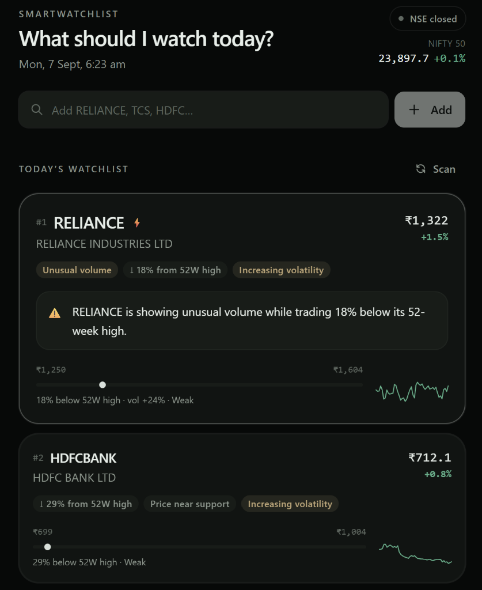
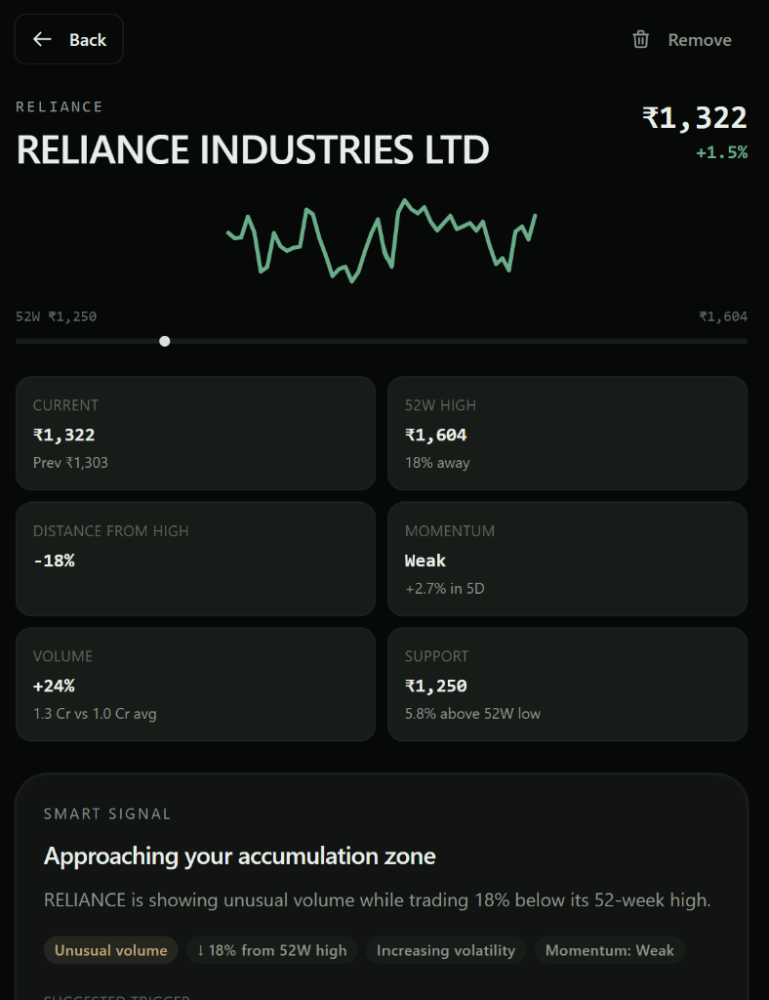
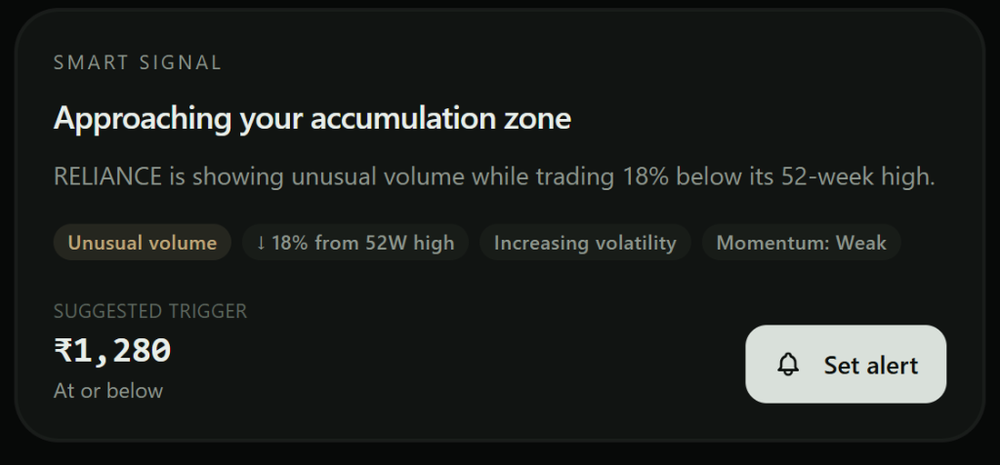
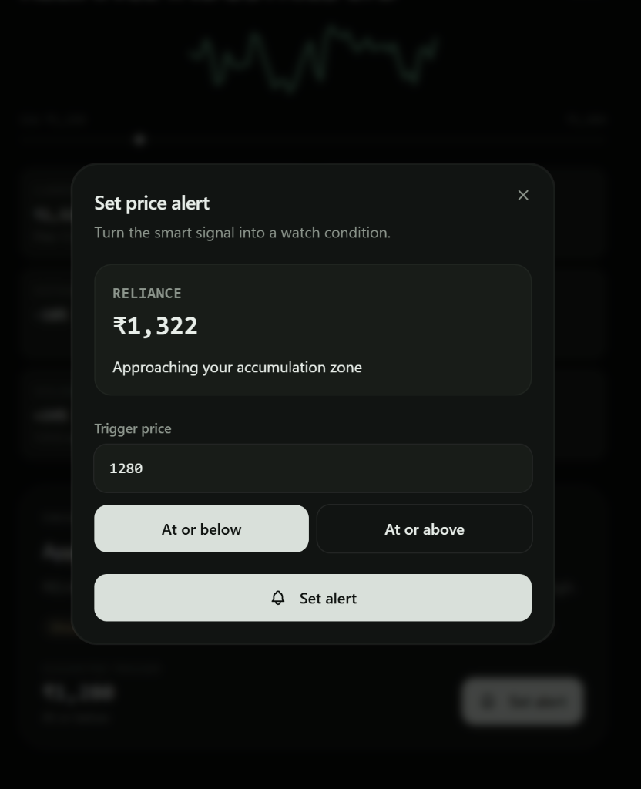

# Smart Watchlist

A stock watchlist that doesn't just track prices — it tells you **why a stock matters today**.

Traditional watchlists show you a wall of tickers and numbers. Smart Watchlist runs a client-side intelligence engine over live market data and surfaces ranked, contextual signals: unusual volume, momentum shifts, support tests, breakout setups, and accumulation-zone proximity — so you focus on what's actionable, not what's noisy.

---

## Demo

> **Backend** → `http://localhost:8000` (FastAPI)  
> **Frontend** → `http://localhost:5173` (Vite + React)

---

## Screenshots

### Ranked Watchlist
Stocks are scored and sorted by the intelligence engine. The top card is highlighted — each card shows signal badges, a contextual headline, 52-week range, and a sparkline.



### Stock Detail
Tap into any stock for a full breakdown: 52-week range bar, current vs previous close, momentum classification, volume delta, and support level.



### Smart Signal
The intelligence engine generates a contextual headline and suggests a price trigger based on the stock's current situation.



### Set Price Alert
Turn any smart signal into a persistent watch condition — set a trigger price, choose direction (at-or-below / at-or-above), and the alert fires when the condition is met.



---

## Architecture

```
┌──────────────────────────────────────────────────────────────────┐
│                        Browser (Client)                          │
│                                                                  │
│  ┌─────────────┐   ┌─────────────────────────────────────────┐   │
│  │ Universe.ts  │   │     useMarket Hook                      │   │
│  │ 30 NSE + US  │──▶│  fetch → 60s auto-refresh               │   │
│  │ tickers      │   │                                         │   │
│  └─────────────┘   └────────────┬────────────────────────────┘   │
│                                 │ raw Quote[]                    │
│                    ┌────────────▼────────────────────┐            │
│                    │   Intelligence Engine (TS)       │            │
│                    │   rankWatchlist · analyzeQuote   │            │
│                    │   9 signal types · scoring       │            │
│                    │   headlines · smart triggers     │            │
│                    └────────────┬────────────────────┘            │
│                                 │ ranked Analysis[]              │
│                    ┌────────────▼────────────────────┐            │
│                    │         React UI                 │            │
│                    │  App · StockCard · StockDetail   │            │
│                    │  AddBar · AlertsRail · Header    │            │
│                    └────────────┬────────────────────┘            │
│                                 │ persist / hydrate              │
│                    ┌────────────▼────────────────────┐            │
│                    │     LocalStorage Store           │            │
│                    │  watchlist · thesis · zones ·    │            │
│                    │  alerts                          │            │
│                    └────────────────────────────────┘            │
└────────────────────────┬─────────────────────────────────────────┘
         JSON (quotes)   │   POST (symbols, zones)
                         │
┌────────────────────────▼─────────────────────────────────────────┐
│                   FastAPI Backend (Data Proxy)                    │
│                                                                  │
│  ┌───────────┐   ┌────────────┐   ┌──────────────────────┐      │
│  │ main.py   │   │ config.py  │   │ market_data.py       │      │
│  │ CORS +    │   │ ticker     │   │ fetch · compute ·    │      │
│  │ routing   │   │ maps       │   │ cache (TTL=120s)     │      │
│  └───────────┘   └────────────┘   └──────────┬───────────┘      │
│                                              │ cache miss        │
└──────────────────────────────────────────────┼───────────────────┘
                                               │
                                   ┌───────────▼───────────┐
                                   │   Yahoo Finance       │
                                   │   yfinance · 1Y daily │
                                   │   OHLCV DataFrame     │
                                   └───────────────────────┘
```

---

## How It Works

### 1. Data Layer (Backend)

The backend is a thin FastAPI server whose **only job** is fetching and caching raw OHLCV data. It exposes a single endpoint:

```
POST /api/market/analyze
Body: { "symbols": ["RELIANCE", "TCS", "INFY"] }
```

**Key design decisions:**

| Decision | Rationale |
|---|---|
| 1-year daily history instead of live intraday | Gives us true 52-week high/low, SMA-20, SMA-50, and enough data for meaningful volatility calculations — without needing a paid data feed |
| In-memory TTL cache (120s) | Protects Yahoo's rate limits while still feeling near-real-time. Stale cache is returned as fallback on failure |
| Auto `.NS` suffix resolution | Any ticker without an exchange suffix is auto-mapped to NSE (`.NS`), with explicit overrides in `config.py` for edge cases like `NIFTY → ^NSEI` |
| 24-symbol hard cap per request | Prevents accidental abuse of the upstream API |

### 2. Intelligence Layer (Frontend)

All intelligence runs **client-side** in `intelligence.ts`. This is deliberate: it keeps the backend stateless, makes the app work offline once quotes are cached, and lets us iterate on signal logic without redeploying the server.

**`analyzeQuote()`** evaluates each stock against 9 signal types:

| Signal | Trigger condition | Weight |
|---|---|---|
| `unusual_volume` | Volume ≥ 20% above 20-day average | 28 |
| `accumulation` | Price within 0–8% of user-set zone | 22 |
| `strong_momentum` | 5-day return ≥ 3%, above SMA-20, within 12% of 52W high | 18 |
| `discount_to_high` | Price ≥ 12% below 52-week high | 14–18 |
| `near_high` | Price within 3% of 52-week high | 16 |
| `near_support` | Price within 4% of 52-week low or hugging SMA-50 | 16 |
| `breakout` | Price > SMA-20 + 5D return ≥ 2% + volume expansion | 14 |
| `volatility` | 5-day range > 1.25× the 20-day norm | 10 |
| `weak_momentum` | Below SMA-20 or 5D return negative or > 15% off high | 6 |

**`rankWatchlist()`** deduplicates signals per kind (keeping the highest-weight instance), sums weights into a composite **score**, and sorts the watchlist. Ties are broken by proximity to the 52-week high.

**Headlines** are generated combinatorially — e.g. "RELIANCE is showing unusual volume while trading 18% below its 52-week high" — not templated from a single signal, giving the user a richer context sentence.

**Smart Triggers** suggest a price alert based on the stock's current situation (accumulation zone, support test, breakout watch, or dip-buy).

### 3. State Layer

A zero-dependency reactive store (`store.ts`) persists:

- **Watchlist** — which tickers you're tracking
- **Thesis** — free-text notes per stock ("Buying on cloud growth thesis")
- **Accumulation Zones** — user-defined buy zones per stock
- **Alerts** — price triggers with direction, note, and fired-at timestamp

Everything is backed by `localStorage` and survives page reloads. The store uses a pub-sub pattern (manual listener set) instead of Context to avoid unnecessary re-renders.

---

## Edge Cases & Resilience

| Scenario | How it's handled |
|---|---|
| Yahoo rate-limits us (HTTP 429) | `rate_limited_until` pauses all requests for 60s; stale cache is served in the meantime |
| Yahoo returns empty data | Graceful `null` return; UI shows "Couldn't load live quotes" with a Retry button |
| Ticker doesn't exist on Yahoo | `fetch_yahoo_quote` returns `None`; the card simply won't render — no crash |
| Indian ticker without `.NS` suffix | `get_quote()` auto-appends `.NS`; explicit overrides in `YAHOO_SYMBOL_MAP` for special tickers |
| NaN values from Yahoo | `_safe_float()` checks `value != value` (NaN detection) and returns `None` |
| LocalStorage full or blocked | `try/catch` around every `setItem`; app works in-memory with defaults |
| Zero volume days (holidays, IPO edge) | Division guards throughout — `avgVolume > 0` checks, `prevClose != 0` checks |
| Browser offline after first load | Cached quotes in store still render; intelligence layer works on whatever data is available |
| Duplicate symbols in request | `dict.fromkeys()` deduplication on the backend before fetching |

---

## Project Structure

```
smart_watchlist/
├── app/                          # FastAPI backend
│   ├── main.py                   # App entry, CORS, router mount
│   ├── config.py                 # Settings, ticker maps, thresholds
│   ├── api/
│   │   └── routes/
│   │       └── market.py         # POST /api/market/analyze
│   └── services/
│       └── market_data.py        # Yahoo Finance fetcher + cache
│
├── frontend/                     # React + Vite + Tailwind v4
│   ├── src/
│   │   ├── App.tsx               # Root shell, routing by state
│   │   ├── main.tsx              # React DOM entry
│   │   ├── index.css             # Tailwind v4 import
│   │   └── lib/
│   │       ├── store.ts          # Zero-dep reactive store
│   │       ├── use-market.ts     # Data-fetching hook (60s refresh)
│   │       ├── format.ts         # INR / percentage formatters
│   │       ├── utils.ts          # cn() helper
│   │       ├── market/
│   │       │   ├── intelligence.ts  # 🧠 Signal engine (9 types)
│   │       │   └── universe.ts      # 30 NSE + US stock catalog
│   │       └── components/
│   │           ├── smart/        # Domain components
│   │           │   ├── stock-card.tsx
│   │           │   ├── stock-detail.tsx
│   │           │   ├── add-bar.tsx
│   │           │   ├── alerts-rail.tsx
│   │           │   ├── set-alert.tsx
│   │           │   ├── header.tsx
│   │           │   ├── sparkline.tsx
│   │           │   └── providers.tsx
│   │           └── ui/           # Reusable primitives
│   │               ├── button.tsx
│   │               ├── badge.tsx
│   │               ├── dialog.tsx
│   │               ├── input.tsx
│   │               ├── label.tsx
│   │               ├── skeleton.tsx
│   │               └── tooltip.tsx
│   └── package.json
│
├── requirements.txt              # Python dependencies
└── .gitignore
```

---

## Getting Started

### Prerequisites

- **Python 3.10+**
- **Node.js 18+**

### 1. Backend

```bash
# Create and activate virtual environment
python -m venv venv
venv\Scripts\activate        # Windows
# source venv/bin/activate   # macOS/Linux

# Install dependencies
pip install -r requirements.txt

# Start the API server
uvicorn app.main:app --reload --port 8000
```

The server is now running at `http://localhost:8000`. Verify with:
```bash
curl http://localhost:8000/health
# → {"message": "Smart Watchlist API is running"}
```

### 2. Frontend

```bash
cd frontend

# Install dependencies
npm install

# Start dev server
npm run dev
```

Open `http://localhost:5173` in your browser.

### 3. Production Build

```bash
cd frontend
npm run build    # outputs to frontend/dist/
```

---

## API Reference

### `POST /api/market/analyze`

Fetches live market data for a list of stock symbols.

**Request:**
```json
{
  "symbols": ["RELIANCE", "TCS", "INFY", "HDFCBANK"]
}
```

**Response:**
```json
{
  "quotes": [
    {
      "symbol": "RELIANCE",
      "yahoo": "RELIANCE.NS",
      "name": "Reliance Industries Ltd.",
      "price": 1245.30,
      "prevClose": 1238.50,
      "changePct": 0.55,
      "high52": 1608.80,
      "low52": 1101.00,
      "volume": 12045678,
      "avgVolume": 9876543,
      "sma20": 1260.45,
      "sma50": 1285.30,
      "ret5d": 2.15,
      "atr14": 25.40,
      "avgRange20": 0.0185,
      "range5": 0.0210,
      "spark": [1220.5, 1225.0, "...48 daily closes"],
      "currency": "INR"
    }
  ],
  "index": { "symbol": "NIFTY", "name": "Nifty 50", "..." : "..." },
  "asOf": "2026-09-07T00:45:00Z",
  "live": true
}
```

### `GET /health`

Returns `{"message": "Smart Watchlist API is running"}`.

---

## Design Decisions

### Why client-side intelligence?

The scoring and signal logic intentionally lives in the browser, not the backend. This gives us:

1. **Stateless backend** — the server is a pure data proxy; no session, no DB, no user state. This means it scales trivially and can be replaced with any data source.
2. **Instant iteration** — signal weights, thresholds, and headline templates can be tuned with a hot reload, no server restart needed.
3. **Offline resilience** — once quotes are fetched, the intelligence layer works entirely from memory. The UI stays functional even if the network drops.

### Why not WebSockets / real-time streaming?

For a watchlist product, **polling on a 60-second interval** is the right tradeoff:

- Yahoo Finance's free tier doesn't support streaming; any WebSocket layer would just poll upstream anyway.
- 60-second granularity is sufficient for daily watchlist decisions (not HFT).
- It keeps the infrastructure simple — no connection management, no reconnection logic, no heartbeats.

### Why a custom store instead of Redux / Zustand?

The state surface is small (4 keys). A 185-line store with `localStorage` persistence and a manual pub-sub pattern gives us everything we need without adding a dependency. The store exposes the same API shape as Zustand (`getState()`, `useStore(selector)`) so it could be swapped in later if needed.

### Why Tailwind v4?

Tailwind v4's CSS-native theme engine (`@theme`) eliminates the need for `tailwind.config.js` entirely. All design tokens (colors, shadows, radii) are defined in a single CSS file, making the design system portable and easy to audit.

---

## Tech Stack

| Layer | Technology |
|---|---|
| Frontend | React 19, TypeScript 6, Vite 8 |
| Styling | Tailwind CSS v4 (CSS-native theme engine) |
| State | Custom reactive store + localStorage |
| Backend | FastAPI, Python 3.10+ |
| Data Source | Yahoo Finance via `yfinance` |
| Caching | In-memory dict with 120s TTL |

---

## License

MIT
